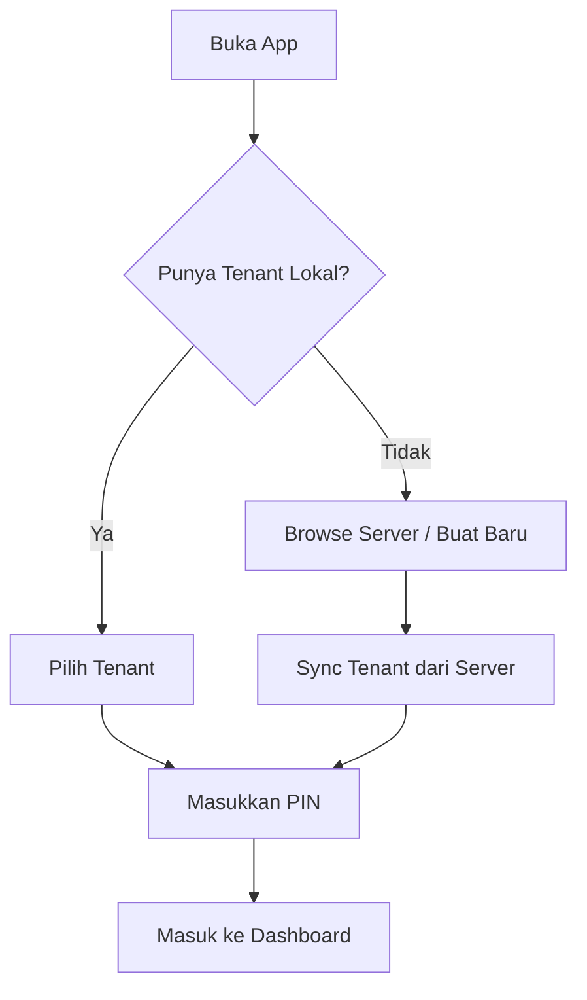

import PlaceholderImg from '@site/src/components/PlaceholderImg';

# Login

Panduan untuk masuk ke aplikasi dan memilih tenant yang akan dikelola.

## Alur Login

---

## Langkah-langkah

### 1. Buka Aplikasi

Buka aplikasi dari browser atau shortcut Home Screen.

**Yang akan Anda lihat:**

- Logo dan branding Koperasi Kegelapan
- Daftar tenant yang tersimpan di perangkat (jika ada)
- Tombol "Browse Server" untuk mencari tenant online
- Tombol "Buat Koperasi Baru" untuk registrasi

<PlaceholderImg caption="Halaman utama login" />

---

### 2. Pilih Tenant

Jika Anda sudah pernah login, tenant akan muncul di daftar lokal.

**Opsi yang tersedia:**

- **Tenant Lokal** — Tap untuk langsung memilih
- **Browse Server** — Cari tenant yang terdaftar di server
- **Buat Baru** — Registrasi tenant baru

**Browse Server:**

- Ketik nama atau kode tenant di search bar
- Hasil pencarian muncul real-time
- Tap tenant untuk sync ke perangkat lokal

<PlaceholderImg caption="Daftar tenant lokal & browse server" />

---

### 3. Masukkan PIN

Setelah memilih tenant, masukkan PIN admin untuk autentikasi.

**Autentikasi:**

- Masukkan PIN 6 digit yang dibuat saat registrasi
- PIN diverifikasi secara lokal (offline-capable)
- Setelah berhasil, Anda masuk ke dashboard

**Keamanan:**

- 5x salah PIN → akun terkunci sementara (5 menit)
- PIN tidak pernah dikirim ke server
- Verifikasi menggunakan hash lokal

<PlaceholderImg caption="Input PIN admin" />

---

### 4. Dashboard Admin

Setelah login berhasil, Anda masuk ke Station mode (dashboard admin).

**Fitur yang tersedia:**

- **Kartu** — Kelola kartu NFC (issue, top-up, block)
- **Anggota** — Manajemen data member
- **Scout** — Cek saldo & riwayat kartu
- **Transaksi** — Lihat riwayat transaksi
- **Pengaturan** — Konfigurasi tenant & perangkat

<PlaceholderImg caption="Dashboard Admin — Station mode" />

---

## Session & Logout

- Session tersimpan di perangkat — tidak perlu login ulang setiap buka app
- Untuk logout: buka menu (hamburger icon) → tap **Logout**
- Logout menghapus session tapi data tenant tetap tersimpan lokal

---

## Troubleshooting

| Masalah                       | Solusi                                                            |
| ----------------------------- | ----------------------------------------------------------------- |
| Tenant tidak muncul di daftar | Gunakan "Browse Server" untuk sync ulang                          |
| PIN salah terus               | Pastikan menggunakan PIN yang benar, tunggu 5 menit jika terkunci |
| Tidak bisa browse server      | Periksa koneksi internet                                          |
| App tidak bisa dibuka         | Clear cache browser, pastikan HTTPS                               |
