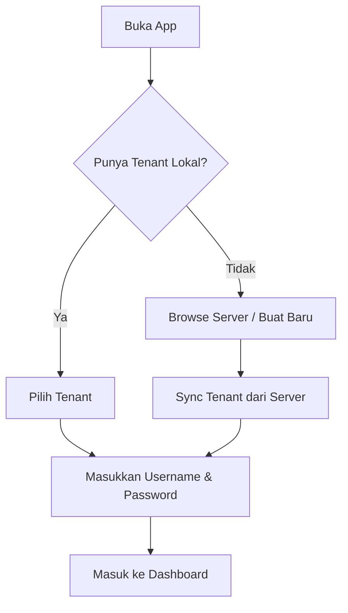
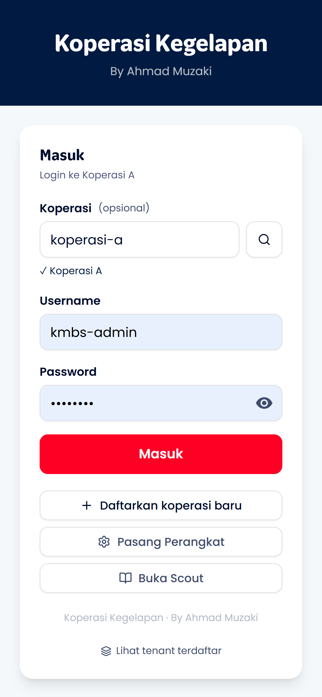
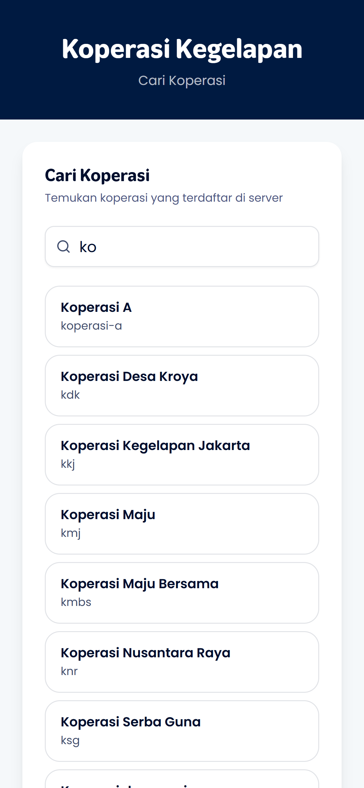
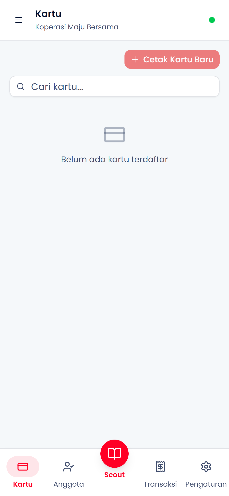

# Login

Panduan untuk masuk ke aplikasi dan memilih tenant yang akan dikelola.

## Alur Login

---

## Langkah-langkah

### 1. Cari & Pilih Tenant

Buka aplikasi dari browser atau shortcut Home Screen. Cari tenant yang ingin Anda kelola.

**Yang akan Anda lihat:**

- Logo dan branding Koperasi Kegelapan
- Daftar tenant yang tersimpan di perangkat (jika ada)
- Tombol "Browse Server" untuk mencari tenant online
- Tombol "Buat Koperasi Baru" untuk registrasi

**Opsi yang tersedia:**

- **Tenant Lokal** - Tap untuk langsung memilih
- **Browse Server** - Cari tenant yang terdaftar di server
- **Buat Baru** - Registrasi tenant baru

---

### 2. Masukkan Username & Password

Setelah memilih tenant, masukkan kredensial untuk autentikasi.

**Autentikasi:**

- Masukkan **username** dan **password** yang dibuat saat registrasi
- Kredensial diverifikasi secara lokal (offline-capable)
- Setelah berhasil, Anda masuk ke dashboard

**Keamanan:**

- 5x salah password → akun terkunci sementara (5 menit)
- Password tidak pernah dikirim ke server dalam plaintext
- Verifikasi menggunakan hash lokal

---

### 3. Dashboard Admin

Setelah login berhasil, Anda masuk ke Station mode (dashboard admin).

**Fitur yang tersedia:**

- **Kartu** - Kelola kartu NFC (issue, top-up, block)
- **Anggota** - Manajemen data member
- **Scout** - Cek saldo & riwayat kartu
- **Transaksi** - Lihat riwayat transaksi
- **Pengaturan** - Konfigurasi tenant & perangkat

---

## Session & Logout

- Session tersimpan di perangkat - tidak perlu login ulang setiap buka app
- Untuk logout: buka menu (hamburger icon) → tap **Logout**
- Logout menghapus session tapi data tenant tetap tersimpan lokal

---

## Troubleshooting

| Masalah                          | Solusi                                                                |
| -------------------------------- | --------------------------------------------------------------------- |
| Tenant tidak muncul di daftar    | Gunakan "Browse Server" untuk sync ulang                              |
| Password salah terus             | Pastikan menggunakan password yang benar, tunggu 5 menit jika terkunci |
| Tidak bisa browse server         | Periksa koneksi internet                                              |
| App tidak bisa dibuka            | Clear cache browser, pastikan HTTPS                                   |
