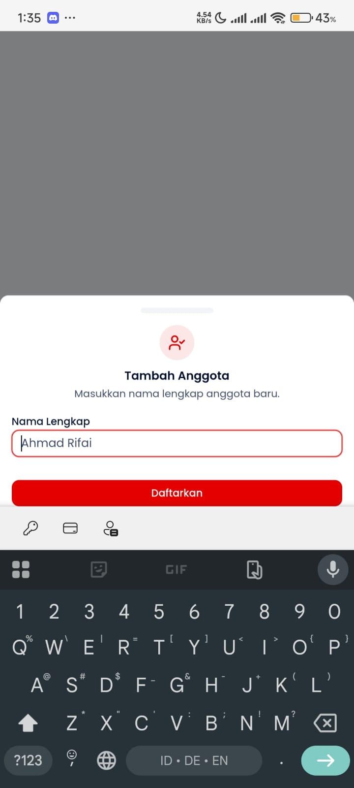
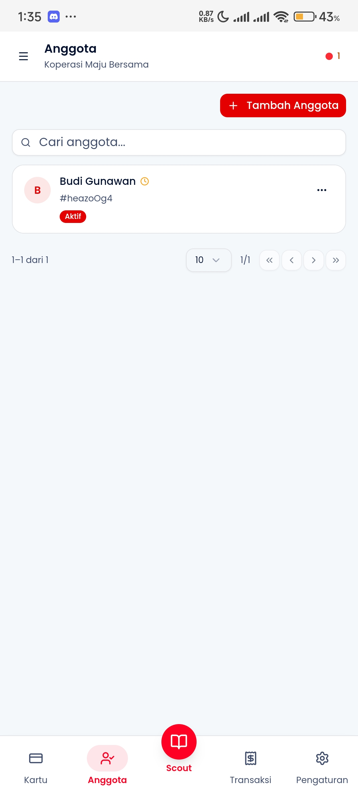

# Manajemen Anggota

Panduan untuk menambah, mengedit, dan mengelola data anggota koperasi.

## Overview

Setiap anggota (member) adalah entitas yang bisa memiliki satu atau lebih kartu NFC. Data anggota disimpan lokal dan di-sync ke server.

---

## Daftar Anggota

**Akses:**

- Tap tab **Anggota** di bottom navigation

**Daftar anggota menampilkan:**

- Nama anggota
- Jumlah kartu aktif
- Status (aktif/non-aktif)
- Tanggal bergabung

**Fitur:**

- Search nama atau nomor anggota
- Filter status: Semua / Aktif / Non-aktif
- Tombol **"+ Tambah Anggota"** untuk membuat baru

---

## Tambah Anggota Baru

### 1. Buka Form Tambah

Tap tombol **"+ Tambah Anggota"** dari daftar anggota.

**Field yang tersedia:**

- **Nama Lengkap** (wajib) - Nama anggota
- **No. Anggota** (opsional) - ID internal koperasi
- **No. HP** (opsional) - Untuk notifikasi
- **Catatan** (opsional) - Informasi tambahan

**Validasi:**

- Nama minimal 2 karakter
- No. HP format Indonesia (+62 / 08xx)

---

### 2. Simpan

**Setelah simpan:**

- Anggota langsung muncul di daftar
- Bisa langsung di-assign kartu NFC
- Data di-sync ke server saat online

**ID Anggota:**

- Auto-generated (UUID)
- Digunakan untuk binding kartu

---

## Nonaktifkan Anggota

**Kapan menonaktifkan:**

- Anggota keluar dari koperasi
- Pelanggaran aturan
- Permintaan anggota sendiri

**Efek nonaktifkan:**

- Semua kartu anggota otomatis di-block
- Anggota tidak muncul di pencarian issue kartu
- Data tetap tersimpan (soft delete)
- Bisa diaktifkan kembali oleh admin

---

## Troubleshooting

| Masalah                        | Solusi                                       |
| ------------------------------ | -------------------------------------------- |
| Anggota tidak muncul di search | Cek filter status, mungkin non-aktif         |
| Tidak bisa hapus anggota       | Sistem menggunakan soft-delete (nonaktifkan) |
| Data tidak sync                | Periksa koneksi, cek status sync di Settings |
| Duplikat anggota               | Edit salah satu, nonaktifkan yang lain       |
