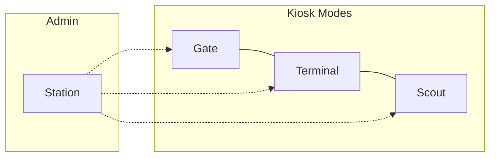
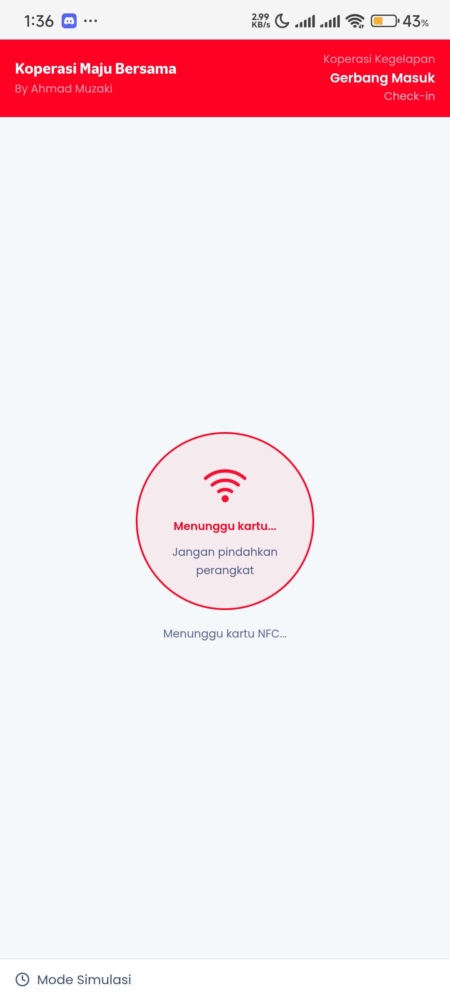
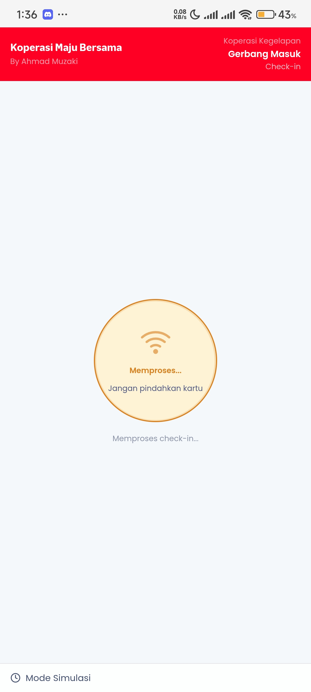
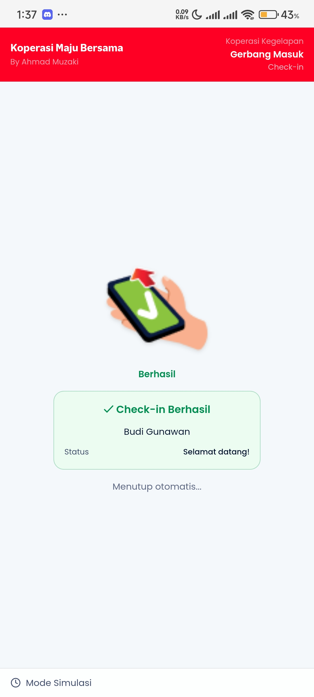
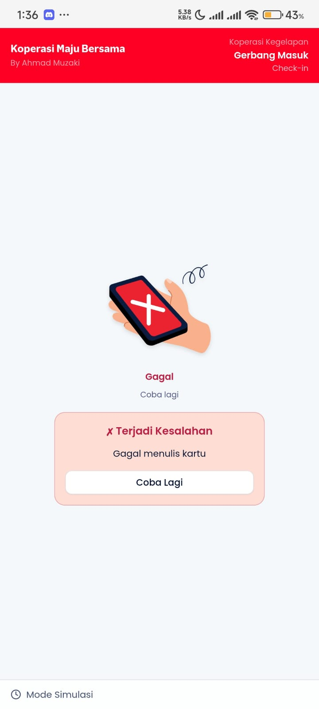
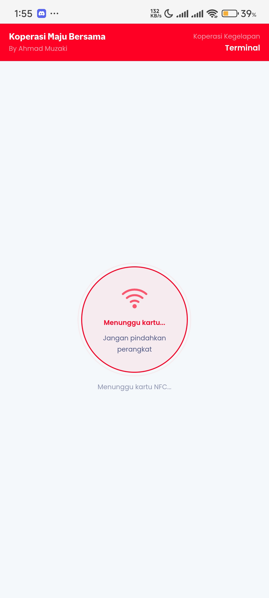
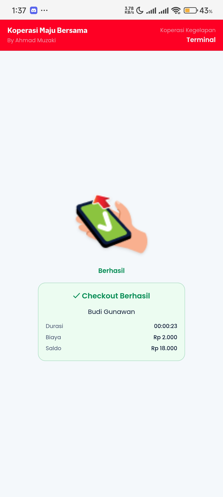
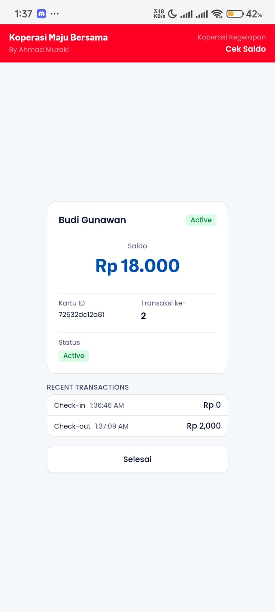
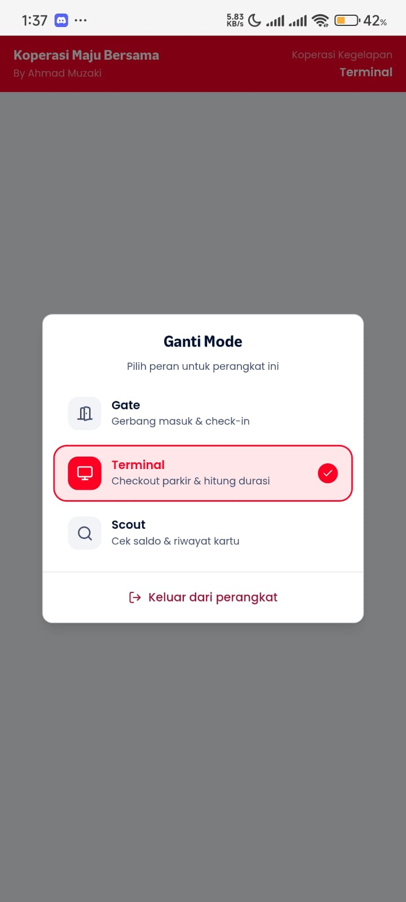

# Mode Kiosk

Panduan penggunaan mode-mode kiosk: **Gate**, **Terminal**, dan **Scout** untuk operasional sehari-hari.

## Overview Mode

Aplikasi memiliki beberapa mode operasional yang bisa diakses dari perangkat yang sudah didaftarkan:

---

## Mode Gate (Check-in)

Gate digunakan di pintu masuk untuk mencatat waktu kedatangan.

### Alur Check-in

**Cara penggunaan:**

1. Perangkat menampilkan layar "Tap Kartu"
2. Anggota menempelkan kartu NFC
3. Sistem membaca kartu & verifikasi
4. Waktu check-in dicatat di kartu

**State kartu berubah:**

- `IDLE` → `CHECKED_IN`
- Timestamp check-in ditulis ke kartu

---

### Proses Write ke Kartu

**Saat kartu ditap:**

- Sistem membaca dan memverifikasi kartu
- Data check-in ditulis ke kartu
- Jangan angkat kartu selama proses write

---

### Check-in Berhasil

**Setelah tap berhasil:**

- Nama anggota ditampilkan
- Waktu check-in ditampilkan
- Animasi sukses (hijau)
- Otomatis kembali ke layar tap setelah 3 detik

---

### Check-in Gagal

**Jika gagal:**

- Kartu tidak dikenali → pesan error
- Kartu sudah checked-in → pesan "Sudah masuk"
- Kartu blocked → pesan "Kartu diblokir"
- Saldo tidak cukup → pesan saldo kurang

---

## Mode Terminal (Checkout)

Terminal digunakan di pintu keluar untuk menghitung durasi dan memotong saldo.

### Alur Checkout

**Cara penggunaan:**

1. Perangkat menampilkan layar "Tap Kartu"
2. Anggota menempelkan kartu NFC
3. Sistem membaca kartu & hitung durasi
4. Tarif dihitung berdasarkan durasi
5. Saldo dipotong & ditulis ke kartu
6. Konfirmasi checkout ditampilkan

**State kartu berubah:**

- `CHECKED_IN` → `IDLE`
- Saldo dikurangi sesuai tarif
- Transaksi dicatat di hash-chain log

---

### Checkout Berhasil

**Informasi checkout:**

- Nama anggota
- Waktu masuk & keluar
- Durasi parkir
- Tarif yang dikenakan
- Saldo sebelum & sesudah

**Perhitungan tarif:**

- Berdasarkan konfigurasi tenant
- Per jam / per hari / flat rate
- Bisa dikustomisasi di Pengaturan

---

## Mode Scout (Cek Saldo)

Scout adalah mode read-only untuk mengecek informasi kartu.

**Informasi yang ditampilkan:**

- Saldo saat ini
- Nama pemilik kartu
- Status kartu (Active/Blocked/Checked-in)
- Transaksi terakhir
- Waktu check-in (jika sedang checked-in)

**Kegunaan:**

- Meja informasi untuk anggota cek saldo
- Verifikasi sebelum top-up
- Troubleshooting kartu bermasalah

**Tidak ada write** - kartu tidak dimodifikasi.

---

## Switching Mode

### Dari Station (Admin)

**Cara switch mode:**

- Perangkat dengan role **Station** bisa switch ke mode apapun
- Long-press logo/header (500ms) untuk membuka mode picker
- Pilih mode yang diinginkan
- Kembali ke Station: long-press lagi

**Perangkat dengan role spesifik:**

- Gate → hanya bisa mode Gate
- Terminal → hanya bisa mode Terminal
- Scout → hanya bisa mode Scout

---

## Tips Operasional

### Penempatan Perangkat

- **Gate:** Di pintu masuk, posisi kartu reader menghadap pengguna
- **Terminal:** Di pintu keluar, pastikan layar terlihat jelas
- **Scout:** Di meja informasi, bisa landscape untuk tampilan lebih lebar

### Battery & Charging

- Gunakan charger yang selalu terpasang untuk perangkat kiosk
- Aktifkan "Stay Awake" di Developer Options Android
- Pertimbangkan case/holder untuk perangkat permanen

### Offline Operation

- Semua mode kiosk bekerja **100% offline**
- Data transaksi disimpan lokal
- Sync otomatis saat koneksi tersedia

---

## Troubleshooting

| Masalah                           | Solusi                                      |
| --------------------------------- | ------------------------------------------- |
| Kartu tidak terbaca di Gate       | Pastikan NFC aktif, coba posisi lain        |
| Checkout gagal - "Belum check-in" | Kartu belum tap di Gate, atau state corrupt |
| Saldo tidak cukup saat checkout   | Anggota perlu top-up di Station             |
| Mode picker tidak muncul          | Long-press minimal 500ms di area header     |
| Layar mati otomatis               | Aktifkan "Stay Awake" di Settings           |
