# Operasi Kartu

Panduan lengkap untuk mengelola kartu NFC: issue kartu baru, top-up saldo, cek saldo, dan block kartu.

## Jenis Kartu

Sistem menggunakan **NTAG215** NFC cards dengan spesifikasi:

- 504 bytes user memory
- Unique 7-byte UID
- Enkripsi AES-256-GCM on-card

---

## Issue Kartu Baru

### 1. Tap Kartu NFC

Dari dashboard admin, tap tab **Kartu** lalu tap tombol **"+ Issue Kartu"**. Tempelkan kartu NFC kosong ke perangkat.

**Proses:**

1. Tap "Issue Kartu" dari menu Kartu
2. Layar menampilkan animasi "Tempelkan Kartu"
3. Dekatkan kartu NFC ke bagian belakang HP
4. Sistem membaca UID kartu

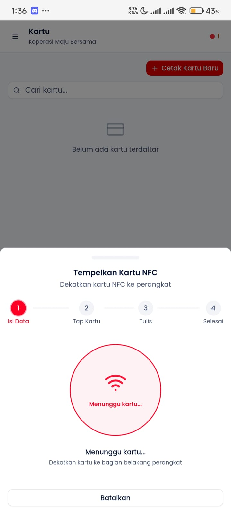

---

### 2. Form Issue Muncul

Setelah kartu terbaca, drawer form issue akan muncul.

**Yang ditampilkan:**

- UID kartu yang terbaca
- Form untuk memilih anggota
- Input saldo awal
- Tombol konfirmasi

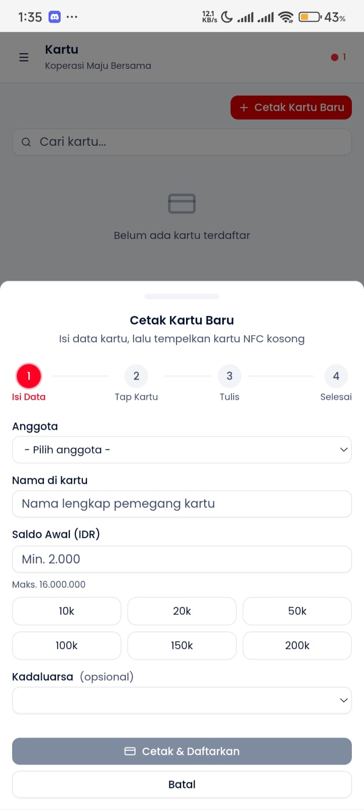

---

### 3. Pilih Anggota

Pilih anggota yang akan menerima kartu.

**Opsi:**

- Pilih dari daftar anggota yang sudah terdaftar
- Atau buat anggota baru langsung dari sini
- Satu anggota bisa memiliki lebih dari satu kartu

**Search:**

- Ketik nama atau ID anggota
- Hasil muncul real-time

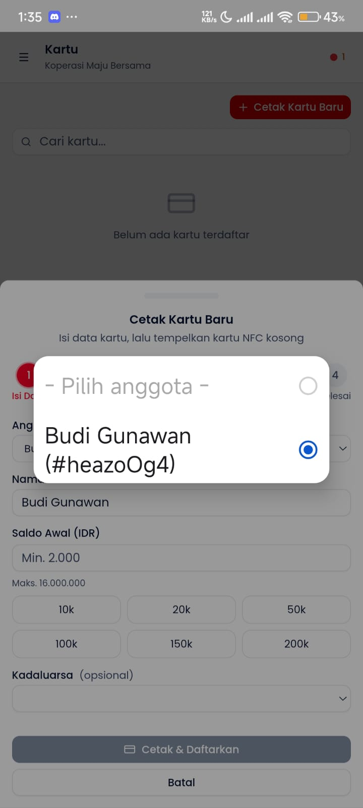

---

### 4. Input Saldo Awal

Masukkan saldo awal untuk kartu (opsional, bisa Rp 0).

**Input saldo:**

- Masukkan nominal saldo awal
- Atau biarkan Rp 0 jika akan top-up nanti
- Konfirmasi data sebelum write

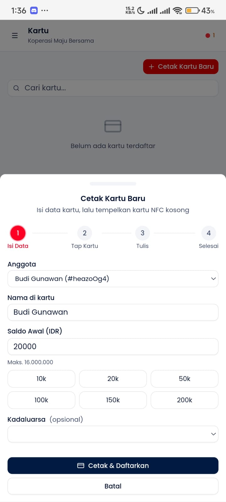

---

### 5. Issue Berhasil

Kartu berhasil di-issue dan siap digunakan.

**Informasi yang ditampilkan:**

- UID kartu (7 byte hex)
- Nama anggota yang terikat
- Saldo awal
- Status: ACTIVE

**Data yang ditulis ke kartu:**

- Wallet state (saldo)
- Tenant ID & member binding
- Cryptographic signature (HMAC)
- A/B buffer untuk write safety

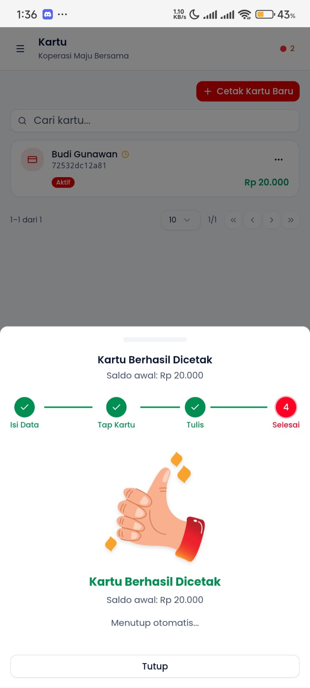

---

### 6. Verifikasi via Scout

Cek kartu yang baru di-issue melalui mode Scout untuk memastikan data tertulis dengan benar.

**Verifikasi:**

- Buka mode Scout
- Tap kartu yang baru di-issue
- Pastikan saldo & data anggota sesuai

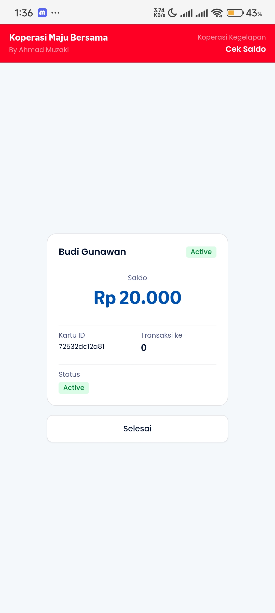

---

## Top-up Saldo

### 1. Scan Kartu

Dari menu Kartu, tap "Top-up" lalu tempelkan kartu ke perangkat.

**Proses scan:**

- Tempelkan kartu ke NFC reader
- Sistem membaca saldo saat ini
- Verifikasi HMAC integrity kartu
- Tampilkan informasi kartu & saldo

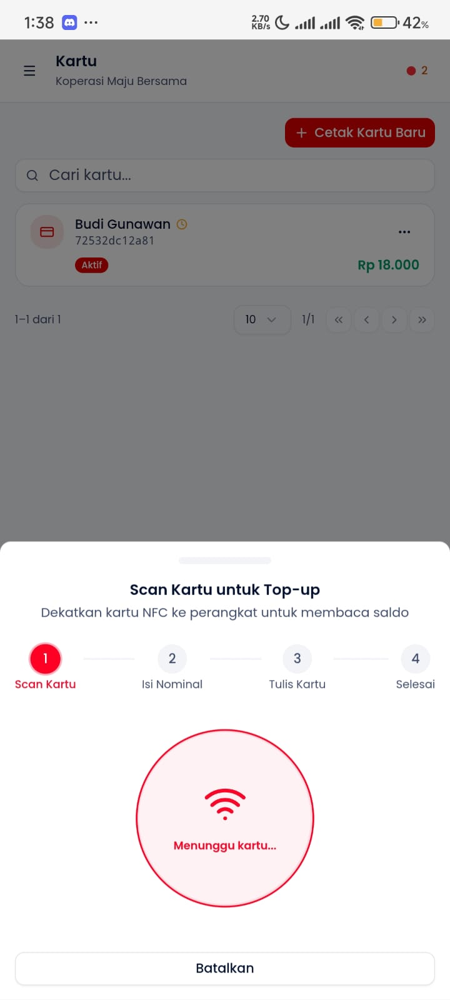

---

### 2. Input Nominal

Masukkan nominal top-up yang diinginkan.

**Masukkan nominal:**

- Ketik nominal manual, atau
- Pilih dari preset (Rp 50K, 100K, 200K, 500K)

**Batas top-up:**

- Minimum: Rp 10.000
- Maximum per transaksi: Rp 500.000
- Saldo maksimal kartu: Rp 16.000.000

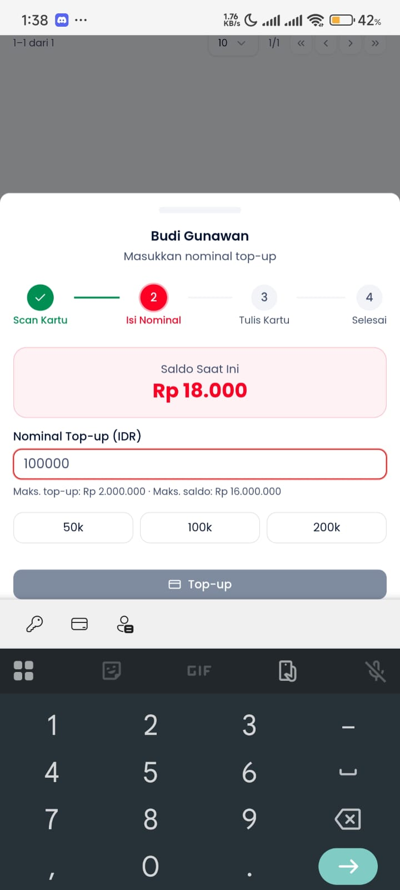

---

### 3. Konfirmasi Nominal

Review nominal yang sudah diisi sebelum melanjutkan write.

**Review:**

- Nominal top-up yang dipilih
- Saldo sebelum dan sesudah
- Validasi nominal (kelipatan Rp 1.000, tidak melebihi batas)

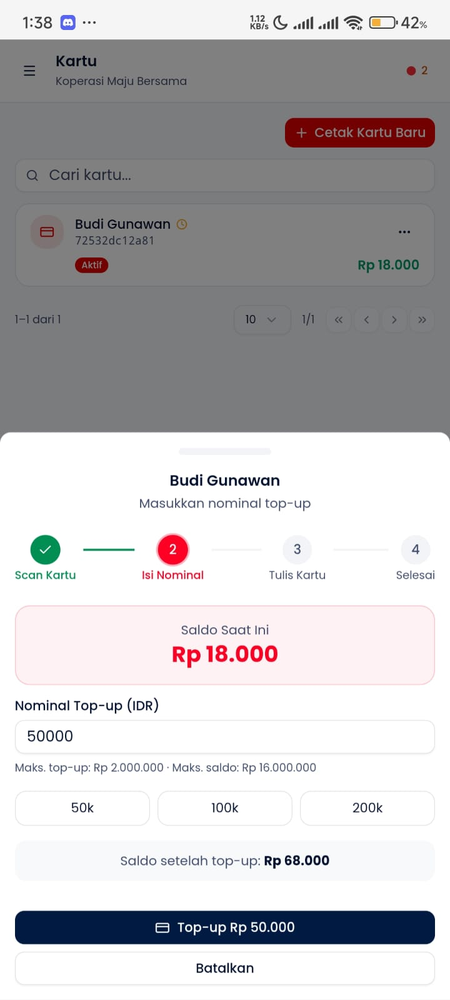

---

### 4. Proses Write ke Kartu

Tempelkan kartu untuk menulis saldo baru.

**Proses write:**

1. Tempelkan kartu ke NFC reader
2. Update saldo + tulis ke buffer
3. Verifikasi write berhasil

**Keamanan:**

- Double-write (A/B buffer) untuk mencegah korupsi
- HMAC verification sebelum dan sesudah write
- Transaksi dicatat di hash-chain log on-card

**Penting:** Jangan angkat kartu selama proses write.

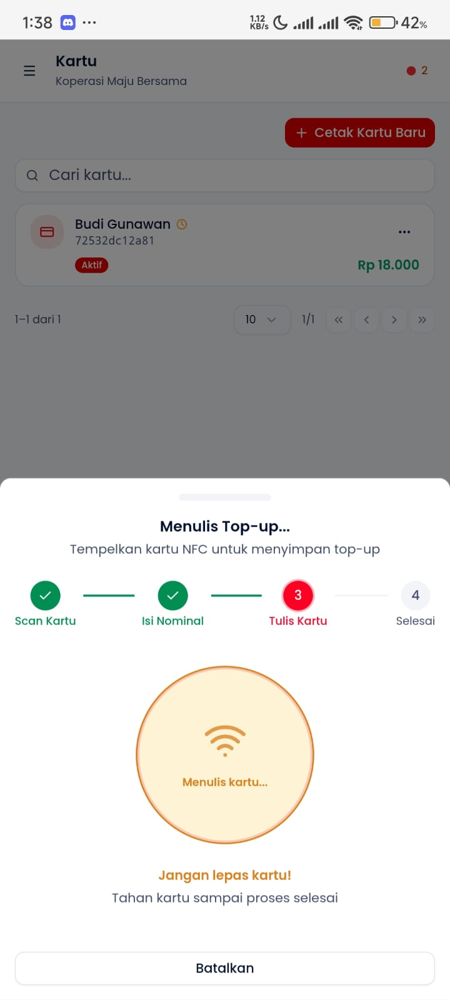

---

### 5. Top-up Berhasil

**Informasi yang ditampilkan:**

- Nominal top-up yang berhasil
- Saldo baru setelah top-up
- Timestamp transaksi

---

### 6. Verifikasi Saldo via Scout

Cek saldo terbaru melalui Scout untuk memastikan top-up berhasil.

**Verifikasi:**

- Buka mode Scout
- Tap kartu yang baru di-top-up
- Pastikan saldo sudah terupdate

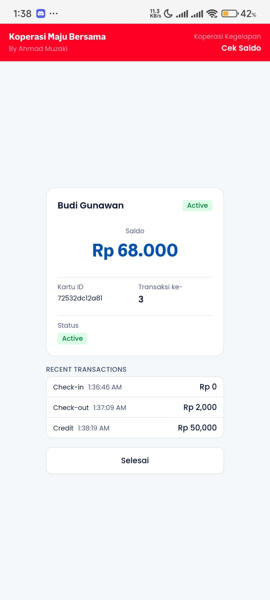

---

## Cek Saldo (Scout)

**Cara cek saldo:**

1. Buka mode **Scout** (dari bottom nav atau mode kiosk)
2. Tempelkan kartu ke perangkat
3. Informasi kartu langsung ditampilkan:
   - Saldo saat ini
   - Nama pemilik
   - Status kartu
   - Transaksi terakhir

**Read-only** - tidak ada perubahan data di kartu.

---

## Block / Unblock Kartu

**Block kartu:**

- Dari daftar kartu → tap kartu → **"Block"**
- Kartu yang di-block tidak bisa digunakan untuk transaksi
- Saldo tetap tersimpan di kartu

**Unblock:**

- Dari daftar kartu → tap kartu blocked → **"Unblock"**
- Kartu kembali aktif dan bisa digunakan

**Kapan block kartu:**

- Kartu hilang/dicuri
- Anggota non-aktif sementara
- Investigasi transaksi mencurigakan

---

## Troubleshooting

| Masalah                          | Solusi                                |
| -------------------------------- | ------------------------------------- |
| Kartu tidak terbaca              | Pastikan NFC aktif, coba posisi lain  |
| Write gagal                      | Jangan angkat kartu saat proses write |
| HMAC verification failed         | Kartu mungkin corrupt, hubungi admin  |
| Saldo tidak update               | Tap ulang untuk re-read, cek di Scout |
| Kartu sudah di-issue tenant lain | Satu kartu hanya bisa 1 tenant aktif  |
