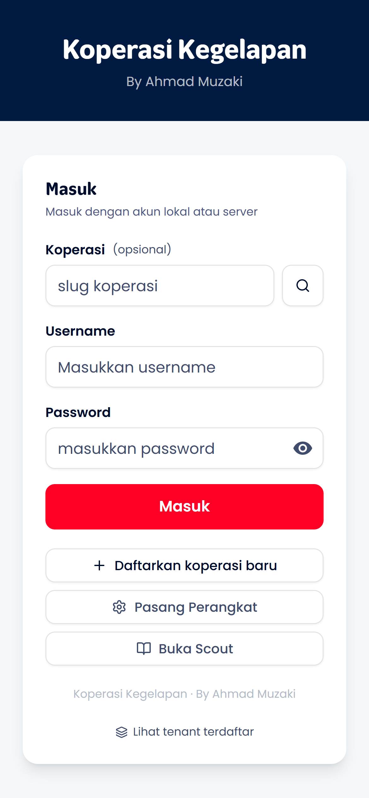
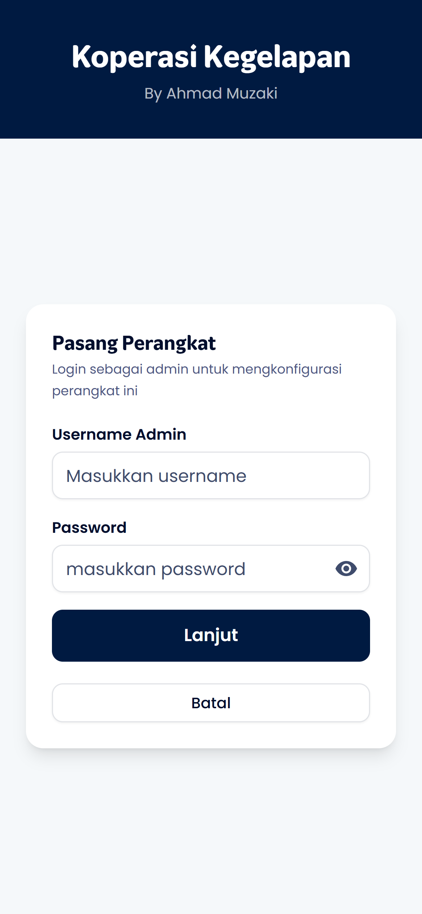
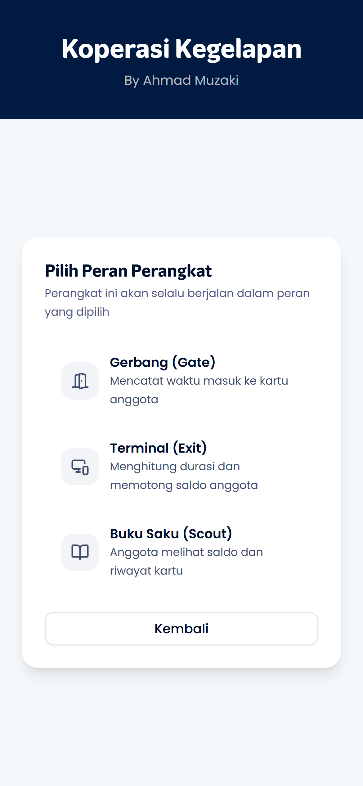
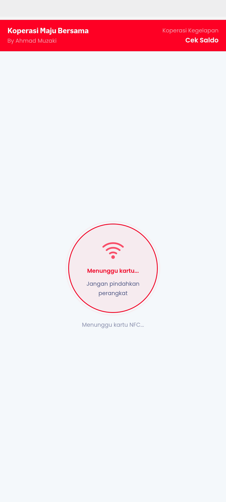

# Pasang Perangkat

Panduan untuk mendaftarkan dan mengkonfigurasi perangkat sebagai terminal operasional (Gate, Terminal, Scout, atau Kiosk).

## Konsep Perangkat

Setiap perangkat fisik (smartphone/tablet) bisa didaftarkan dengan **role** tertentu:

| Role         | Fungsi                   | Lokasi Tipikal      |
| ------------ | ------------------------ | ------------------- |
| **Gate**     | Check-in masuk area      | Pintu masuk parkir  |
| **Terminal** | Checkout & hitung durasi | Pintu keluar parkir |
| **Scout**    | Cek saldo & riwayat      | Meja informasi      | 

---

## Langkah-langkah

### 1. Tap "Pasang Perangkat" di Landing Page

Dari halaman utama aplikasi, tap tombol **"Pasang Perangkat"** untuk memulai proses setup.

**Yang perlu dilakukan:**

- Buka URL aplikasi di browser perangkat yang ingin didaftarkan
- Pada halaman utama, tap tombol **"Pasang Perangkat"**

**Prasyarat perangkat:**

- Browser mendukung Web NFC API (Chrome Android 89+)
- NFC reader aktif (untuk operasi kartu nanti)

---

### 2. Login ke Tenant

Anda akan diminta login terlebih dahulu untuk mengautentikasi perangkat.

**Yang perlu dilakukan:**

- Pilih tenant yang ingin dipasangi perangkat
- Masukkan username & password admin
- Setelah berhasil login, lanjut ke pemilihan role

**Catatan:**

- Hanya admin yang bisa mendaftarkan perangkat baru
- Login diperlukan untuk mengaitkan perangkat dengan tenant

---

### 3. Pilih Role Perangkat

Tentukan fungsi perangkat ini dalam operasional.

**Pilihan role:**

- **Gate** - Hanya bisa melakukan check-in
- **Terminal** - Hanya bisa melakukan checkout
- **Scout** - Hanya bisa cek saldo (read-only)

**Catatan:**

- Role menentukan mode yang tersedia di perangkat
- Perangkat dengan role spesifik langsung masuk ke mode kiosk
- Untuk akses penuh (Station), login lewat alur biasa

---

### 4. Perangkat Aktif dalam Mode Kiosk

Setelah memilih role, perangkat langsung aktif dalam mode kiosk yang sesuai.

**Apa yang terjadi:**

- Device ID disimpan di IndexedDB lokal
- Role di-lock untuk perangkat ini
- Perangkat otomatis masuk ke tampilan kiosk
- Data device di-sync ke server saat online

**Tampilan Kiosk:**

- Navigasi admin disembunyikan
- Hanya menampilkan UI operasional sesuai role
- Long-press logo (500ms) untuk akses mode picker
- Cocok untuk perangkat yang dipasang permanen

---

## Manajemen Perangkat

### Melihat Daftar Perangkat

Di menu **Pengaturan** → **Perangkat**, admin bisa melihat semua perangkat yang terdaftar:

- Nama/ID perangkat
- Role yang ditetapkan
- Status online/offline
- Terakhir aktif

### Reset Perangkat

Untuk mengubah role atau melepas perangkat:

1. Buka **Pengaturan** → **Perangkat**
2. Tap perangkat yang ingin di-reset
3. Pilih **"Reset Perangkat"**
4. Konfirmasi - perangkat kembali ke mode Station

---

## Troubleshooting

| Masalah                          | Solusi                                 |
| -------------------------------- | -------------------------------------- |
| NFC tidak terdeteksi             | Pastikan NFC aktif di Settings Android |
| Web NFC not supported            | Gunakan Chrome Android 89+             |
| Perangkat tidak bisa di-lock     | Pastikan login sebagai admin           |
| Mode tidak berubah setelah setup | Refresh halaman / restart app          |
