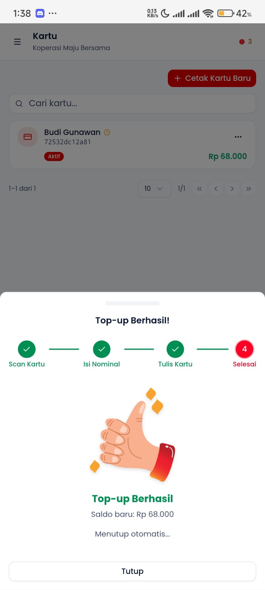
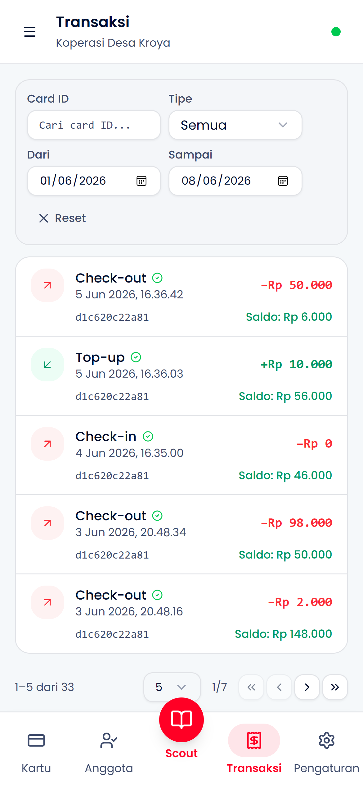
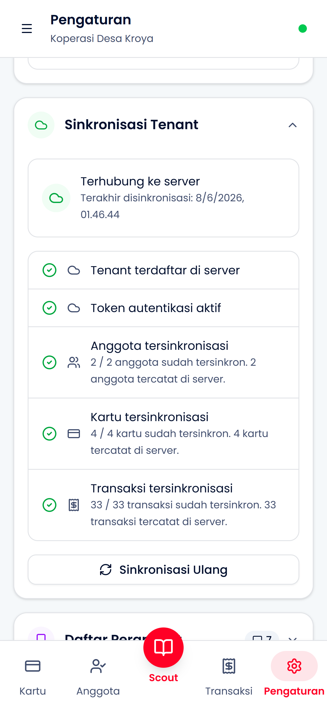

# Transaksi

Panduan untuk melihat, memahami, dan mengelola riwayat transaksi di sistem.

## Jenis Transaksi

| Tipe        | Deskripsi              | Efek Saldo    |
| ----------- | ---------------------- | ------------- |
| `ISSUE`     | Penerbitan kartu baru  | Saldo = 0     |
| `TOPUP`     | Pengisian saldo        | + Nominal     |
| `CHECK_IN`  | Masuk area (Gate)      | Tidak berubah |
| `CHECK_OUT` | Keluar area (Terminal) | - Tarif       |
| `BLOCK`     | Pemblokiran kartu      | Tidak berubah |
| `UNBLOCK`   | Pembukaan blokir       | Tidak berubah |

---

## Contoh Transaksi

### Top-up Berhasil

**Informasi yang dicatat:**

- Tipe: `TOPUP`
- Nominal yang diisi
- Saldo sebelum & sesudah
- Timestamp
- Perangkat yang memproses

---

### Check-in Berhasil

**Informasi yang dicatat:**

- Tipe: `CHECK_IN`
- Waktu masuk
- Nama anggota
- UID kartu
- Perangkat Gate yang memproses

---

### Checkout Berhasil

**Informasi yang dicatat:**

- Tipe: `CHECK_OUT`
- Waktu masuk & keluar
- Durasi parkir
- Tarif yang dikenakan
- Saldo sebelum & sesudah

---

## Melihat Riwayat Transaksi

### Dari Menu Transaksi

**Akses:**

- Tap tab **Transaksi** di bottom navigation
- Daftar transaksi ditampilkan terbaru di atas

**Informasi per transaksi:**

- Tipe transaksi (icon & warna)
- Nama anggota / UID kartu
- Nominal (jika ada)
- Waktu transaksi
- Perangkat yang memproses

---

### Filter & Pencarian

**Filter yang tersedia:**

- **Tipe:** Semua / Top-up / Check-in / Checkout / Issue
- **Periode:** Hari ini / Minggu ini / Bulan ini / Custom
- **Anggota:** Filter per anggota tertentu
- **Perangkat:** Filter per device yang memproses

**Search:**

- Cari berdasarkan nama anggota
- Cari berdasarkan UID kartu

---

## Transaksi & Sinkronisasi

### Status Sync

**Indikator status:**

- 🟢 **Synced** - Sudah tersimpan di server
- 🟡 **Pending** - Menunggu koneksi untuk sync
- 🔴 **Conflict** - Ada konflik yang perlu resolusi

**Cara kerja sync:**

1. Transaksi dicatat lokal (IndexedDB + on-card)
2. Masuk ke Outbox queue
3. Saat online, dikirim ke server
4. Server memvalidasi & menyimpan
5. Status berubah ke "Synced"

**Offline-first:**

- Semua transaksi valid meski offline
- Kartu adalah source of truth
- Server hanya untuk backup & reporting

---

### Manual Sync

**Trigger sync manual:**

- Buka **Pengaturan** → lihat status sync
- Tap **"Sync Sekarang"** untuk memaksa sync
- Berguna setelah lama offline

**Informasi sync:**

- Jumlah transaksi pending
- Terakhir sync berhasil
- Status koneksi ke server

---

## Ringkasan & Laporan

**Ringkasan yang tersedia:**

- Total transaksi hari ini
- Total top-up (pemasukan)
- Total checkout (pengeluaran)
- Jumlah anggota aktif hari ini

**Periode:**

- Harian / Mingguan / Bulanan
- Custom date range

**Export:**

- Data bisa di-export via server dashboard
- Format CSV untuk analisis lebih lanjut

---

## Cek Riwayat via Scout

Selain dari menu Transaksi, riwayat juga bisa dilihat per kartu lewat mode Scout:

**Cara:**

1. Buka mode **Scout**
2. Tempelkan kartu ke perangkat
3. Transaksi terakhir ditampilkan bersama info saldo

**Kegunaan:**

- Verifikasi cepat transaksi terakhir
- Anggota bisa cek sendiri tanpa akses admin

---

## Troubleshooting

| Masalah                | Solusi                                                  |
| ---------------------- | ------------------------------------------------------- |
| Transaksi tidak muncul | Refresh halaman, cek filter aktif                       |
| Status "Pending" lama  | Periksa koneksi internet, trigger manual sync           |
| Conflict muncul        | Biasanya karena kartu di-tap di 2 device bersamaan      |
| Nominal tidak sesuai   | Cek konfigurasi tarif di Pengaturan                     |
| Transaksi hilang       | Data on-card adalah source of truth, tap kartu di Scout |
